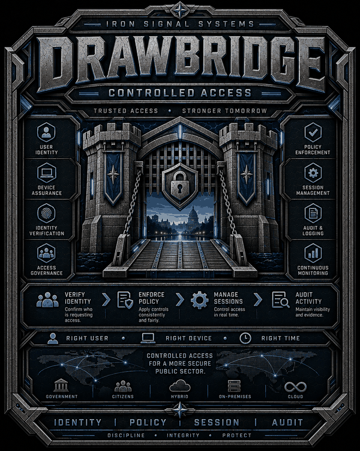

# Drawbridge

  

**Drawbridge by Iron Signal Systems**

Drawbridge is a mobility-first remote-access platform intended to preserve secure, authorized network access across changing or unreliable networks while remaining understandable to network and systems administrators.

Drawbridge is a separate Iron Signal Systems product. It may integrate closely with Stronghold, but it must remain independently deployable behind conventional enterprise firewalls and routing environments.

Canonical Drawbridge architecture terminology is defined in [TERMINOLOGY.md](TERMINOLOGY.md). Those terms are normative throughout the project.

## Product statement

> Drawbridge provides a controlled, persistent path between authorized devices, users, and enterprise services across changing or untrusted networks.

Drawbridge is not intended to be "another VPN." Its core design goals are:

- persistent device and user connectivity across network changes;
- clear separation of device identity, user authorization, network state, and application authorization;
- Active Directory and enterprise PKI as first-class integration points for domain-managed Windows environments;
- a separate shared-services trust model for non-domain devices and agencies;
- deterministic access policy that a network administrator can explain;
- first-class test/staging and promotion workflows;
- Git-like, attributable production change history;
- forensic-quality Records of connection attempts, DNS context, network changes, policy decisions, location observations, and gateway actions;
- licensing that can never become a packet-forwarding dependency;
- site-based licensing rather than per-user or per-device seat counting.

## Design principles

1. **Connectivity is not trust.**
2. **The device establishes the transport; the user receives authorization.**
3. **Commercial licensing never terminates authorized production connectivity.**
4. **Production changes are versioned, commented, tested, attributable, and reversible.**
5. **The exact configuration tested is the configuration promoted.**
6. **Test/staging is a first-class feature, not an optional lab SKU.**
7. **The Drawbridge Agent stays out of the user's way when healthy.**
8. **The infrastructure does not stay out of the administrator's way when something is wrong.**
9. **A connected tunnel is not proof that required services are functional.**
10. **Records are a first-class subsystem, not a reporting add-on.**
11. **Canonical Records and recovery objects are immutable from birth; later facts create new objects.**
12. **Shared-service connectivity does not imply domain trust or endpoint administrative authority.**
13. **Drawbridge should make secure change safer than doing nothing.**
14. **The internal policy model should be simple and deterministic even when external integrations are broad.**
15. **Agents target a stable Drawbridge service; replaceable ingress/Gateway nodes must not redefine session identity or authorization.**

## Initial target

The first serious target is a Windows-centric enterprise/public-safety deployment:

- distinct Windows Domain Agent and Shared-Service Agent implementations;
- Drawbridge Controller;
- stable Drawbridge Service Address;
- redundant Drawbridge Front Distributor tier;
- redundant Drawbridge Gateway nodes;
- Active Directory integration;
- AD CS / domain PKI integration;
- optional NPS/RADIUS integration;
- shared-services mode using Drawbridge-managed device PKI;
- trusted-network detection;
- persistent mobility session;
- device-management plane;
- user authorization plane;
- deterministic access policies;
- immutable-from-birth Records;
- Drawbridge Recovery Store outside the production AD trust boundary;
- test/staging;
- versioned promotion and rollback.

## Documents

- [AGENTS.md](AGENTS.md)
- [LICENSE](LICENSE)
- [TERMINOLOGY.md](TERMINOLOGY.md)
- [ARCHITECTURE.md](ARCHITECTURE.md)
- [HA-AND-SESSION-CONTINUITY.md](HA-AND-SESSION-CONTINUITY.md)
- [THREAT-MODEL.md](THREAT-MODEL.md)
- [IDENTITY-AND-TRUST.md](IDENTITY-AND-TRUST.md)
- [POLICY-AND-STATE.md](POLICY-AND-STATE.md)
- [ROUTING-AND-DEPLOYMENT.md](ROUTING-AND-DEPLOYMENT.md)
- [AGENT-SENSOR-AND-DNS.md](AGENT-SENSOR-AND-DNS.md)
- [RECORDS.md](RECORDS.md)
- [RECOVERY-STORE.md](RECOVERY-STORE.md)
- [TESTING-AND-CHANGE-CONTROL.md](TESTING-AND-CHANGE-CONTROL.md)
- [LICENSING.md](LICENSING.md)
- [OPERATIONS.md](OPERATIONS.md)
- [ROADMAP.md](ROADMAP.md)
- [OPEN-QUESTIONS.md](OPEN-QUESTIONS.md)
- [REVIEW-CHECKLIST.md](REVIEW-CHECKLIST.md)

## Status

This repository baseline is a design package only. It intentionally contains no production code yet.

The Issue #2 threat-model design baseline is closed and documented in [THREAT-MODEL.md](THREAT-MODEL.md). Later implementation constants such as timeouts, queue limits, and cache lifetimes remain owned by their corresponding design issues.

No implementation should be treated as approved until the remaining pre-code architecture issues are reviewed and accepted.
